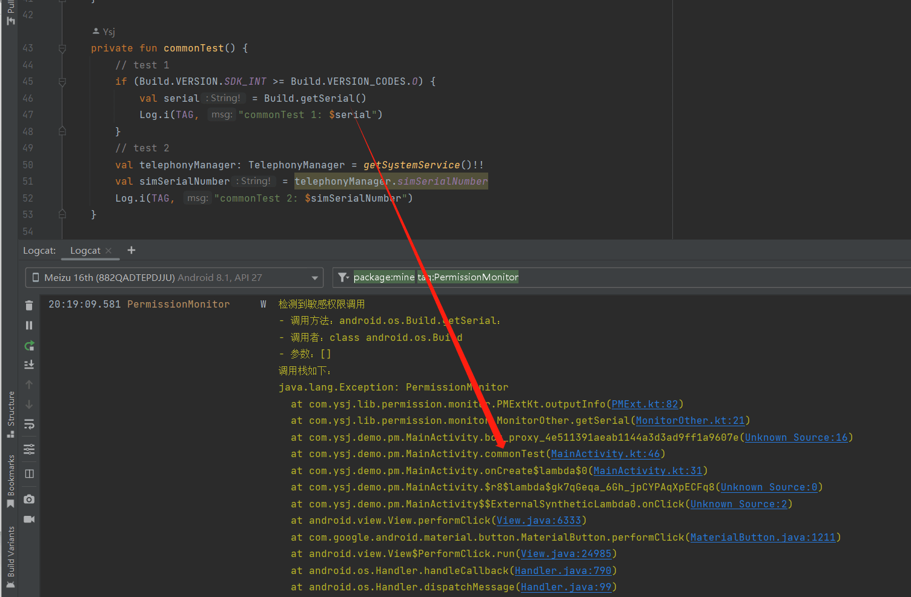
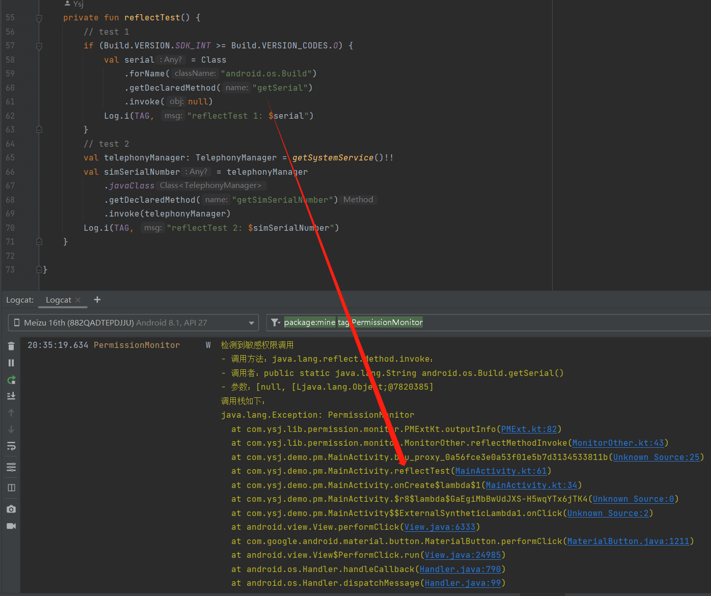

## Android Permission Monitor

Android 隐私政策敏感权限监控。

通过在编译时代理敏感调用来监控敏感权限是否被调用，并支持检测通过反射调用敏感权限的行为。

- 如果本项目对你有所帮助，欢迎 start。
- 如果有遗漏的敏感权限欢迎提 issues 给我。

### 使用

1. 本库基于 [BCU](https://github.com/Ysj001/BytecodeUtil) 的 [modifier-aspect](https://github.com/Ysj001/BytecodeUtil/blob/master/lib_modifier_aspect/README.md) 实现，如何挂载请跳转查看。

2. 在挂载好后直接在 `app` 模块添加依赖即可。

   ```groovy
   dependencies {
       // 只在 debug 下依赖
       debugRuntimeOnly(project(":lib_permission_monitor"))
   }
   ```

3. 在 `logcat` 中过滤  `tag` 为 `PermissionMonitor`，即可观察到是否有敏感权限被调用了。

   - 普通调用监控效果如下：

     

   - 反射调用监控效果如下：

     


